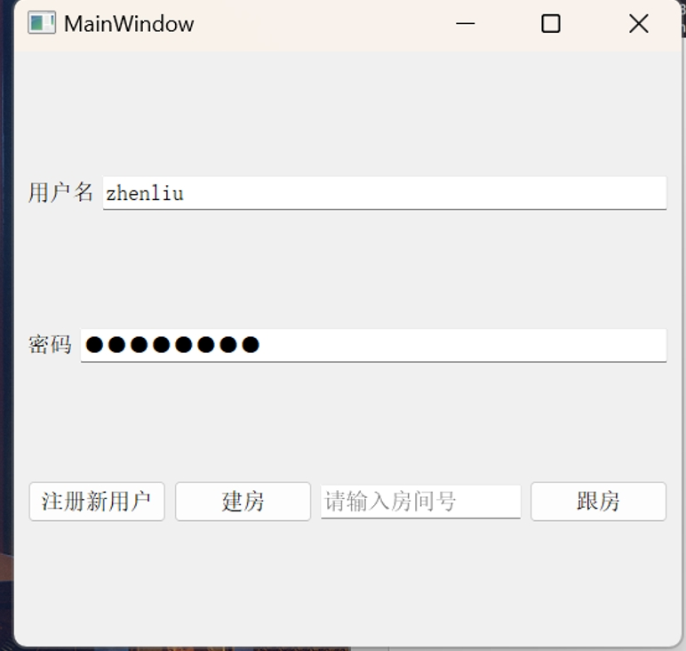
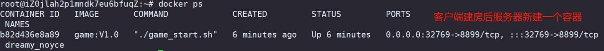
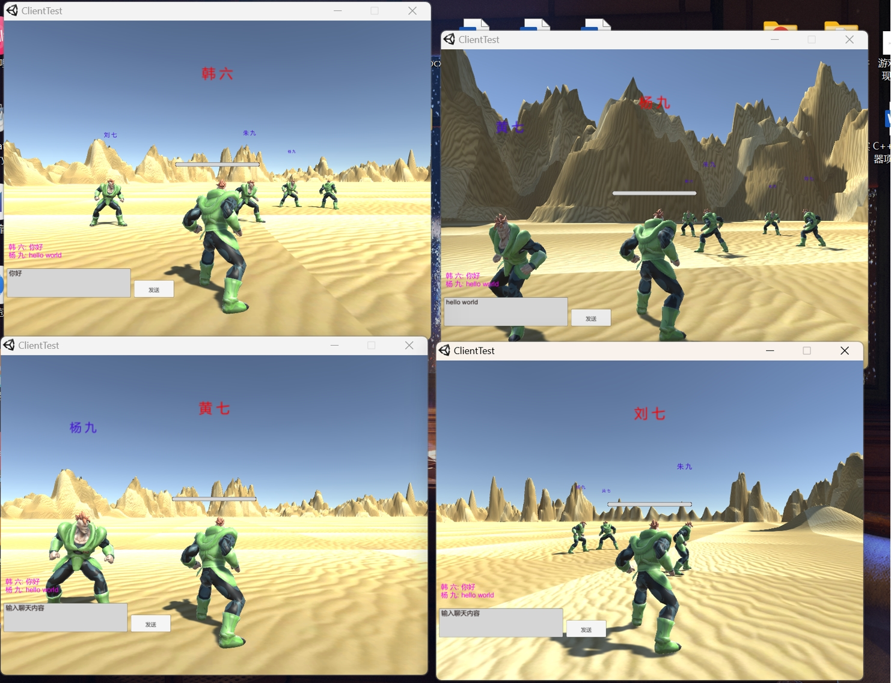

# GameServer

**需要游戏客户端的联系qq2368410997**

新用户可以通过注册新用户按键跳转到网页进行注册：

注册后建房或者跟房:

 
点击建房之后服务器启动一个新容器，客户端启动游戏:

 
当一个房间所有玩家都退出之后，10秒内无新人加入，服务器容器退出:

 
**描述：**
该项目实现了一个多人在线对战游戏的服务器部分，类似吃鸡。服务器负责分发游戏数据、计算打斗数值、同步游戏进度等功能。项目基于Linux原生的epoll模型，采用三层架构形成的并发框架。涉及的技术包括protobuf、redis、时间轮定时器、timerfd等。使用了责任链、工厂方法、代理等设计模式。游戏服务器支持分布式多实例部署，运用了Nginx+Fastcgi、Docker、JSON、Redis发布订阅和Thrift-C++的RPC调用等技术。

**特性：**
1. 玩家上下线数据同步（基于AOI算法进行位置更新）
2. 玩家信息管理（基于Redis存储和获取数据）
3. 服务器延时自动关闭（轮转定时器）
4. 游戏房间管理（Redis存储房间信息，RPC实现房间操作）
5. 玩家登陆注册（FastCGI结合数据库）

**开发时测试截图：**

如果有其他问题或需要进一步了解，可以随时联系qq2368410997。
